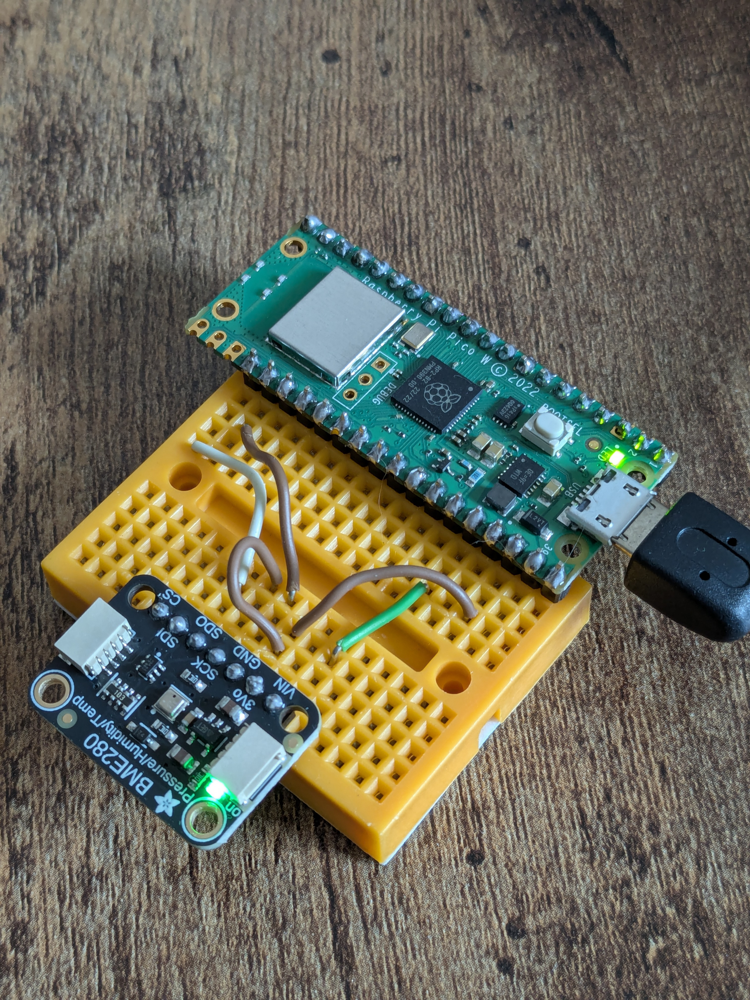

# picoserver



## tinygo build
```
tinygo build -target=pico -opt=1 -stack-size=8kb -size=short -o main.uf2 .
```

Copy the uf2 to the Pico W.

OR

## tinygo flash
```
tinygo flash -target=pico -opt=1 -stack-size=8kb -size=short .
```

See logging info using `tinygo monitor`
